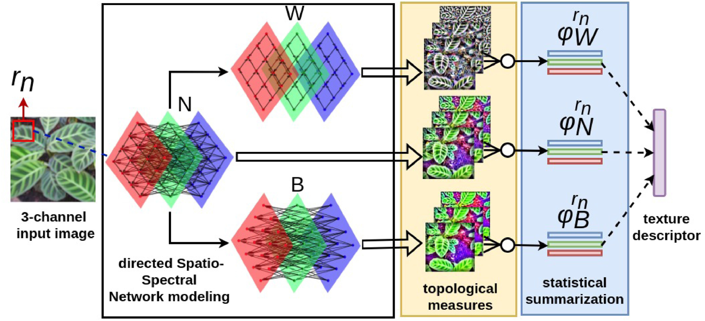

# SSN
Code for Spatio-Spectral Networks (SSN), a method to compute color-texture descriptors from images, from the paper "Spatio-spectral networks for color-texture analysis".

Preprint: https://arxiv.org/abs/1909.06446

Journal version: https://www.sciencedirect.com/science/article/pii/S0020025519310874


<p align="center">
    
</p>


The code was implemented using Matlab and C++. The binary "mexa64" works on Linux 64 bit systems, while "mexw64" works on Windows 64 bits. If you are running a different system, you may need to compile the C++ sources ".cpp" using MEX:
```
mex('SSN_getFeatureMaps.cpp')
mex('SSNgrey_getFeatureMaps.cpp')
```

## Usage

  * Given a pixel matrix representing an 'image' and a maximum radius 'rn' for neighboring pixel analysis, call the main function SSN:  
  ```
  features = SSN(image, rn)
 ```
  * It works either with 3d matrices (i.e., color images) or 2d matrices (grayscale). However, notice that the method was developed for color images (see the paper). 
## Cite

If you use this method, please cite our paper:

Scabini, Leonardo FS, Lucas C. Ribas, and Odemir M. Bruno. "Spatio-spectral networks for color-texture analysis." Information Sciences 515 (2020): 64-79.

```
@article{scabini2020spatio,
  title={Spatio-spectral networks for color-texture analysis},
  author={Scabini, Leonardo FS and Ribas, Lucas C and Bruno, Odemir M},
  journal={Information Sciences},
  volume={515},
  pages={64--79},
  year={2020},
  publisher={Elsevier}
}
```
